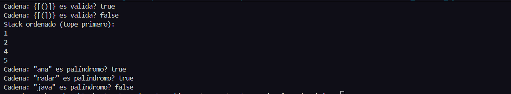

# **INFORME DE INVESTIGACION**

### **Asignatura:** Estructura de Datos

### **Tema:** Pilas y Colas

# Integrante:
- Jose Avecillas  

# Objetivos:

Entender el funcionamiento de pilas y colas

#  Ejemplos 

